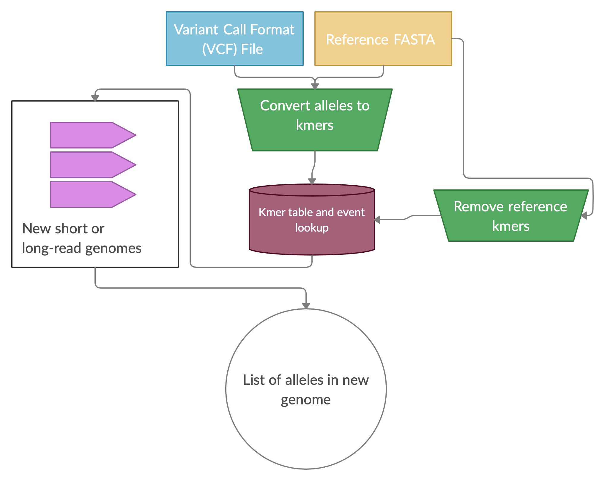

# NibblerSV

## Contributors

Brent Pederson<sup>1</sup>, Christopher Dunn<sup>2</sup>, Eric Dawson<sup>3</sup>, Fritz Sedlazeck<sup>4</sup>, Peter Xie<sup>5</sup>, and Zev Kronenberg<sup>2</sup>

<sup>1</sup> University of Utah; <sup>2</sup>PacBio; <sup>3</sup>Nvidia Corporation; <sup>4</sup>Baylor College of Medicine; <sup>5</sup>JBrowse (UC Berkeley);

## Intro statement
Structural variation (SV) are the largest source of genetic variation within the human population. Long read DNA sequencing is becoming the preferred method for discovering structural variants. Structural variation can be longer than a short-read (<500bp) DNA trace, meaning the SV allele is not contained, which causes challenges and problems in the detection.

Long read sequencing has proven superior to identify Structural Variations in individuals. Nevertheless, it is important to obtain accurate allele frequencies of these complex alleles across a population to rank and identify potential pathogenic variations.  Thus, it is important to be able to genotype SV events in a large set of previously short read based sequenced samples (e.g. 1000genomes, Topmed, CCDG, etc.).  Two main approaches has been recently shown to achieve this with high accuracy even for insertions: Paragraph and VG. However, these methods still consume hours per sample and even more depending on the number of SV to be genotyped along the genome or in regions. Furthermore and maybe more crucially rely on precise breakpoints that do not change in other samples. This assumption might be flawed over repetitive regions.  In addition the problem currently arises that some data sets are mapped to different genomic version than others (e.g hg19 vs. GRCH38 vs. CHM13) and will require a different VCF catalog to be genotyped.  

# Why NibblerSV
NibblerSV can overcome these challenges. NibblerSV relies on a k-mer based strategy to identify SV breakpoints in short read data set. Due to innovative k-mer design and efficient implementation, NibblerSV is able to run on a 30x cram file within minutes with low memory requirements. Its k-mer strategy of spaced k-mers allow a relaxed constrain on the precision of the breakpoint. In addition, utilizing k-mers NibblerSV is independent of the genomic reference the short reads were aligned to and can even work on raw fastq reads. This makes NibblerSV a lightweight, scalable and easy to apply methods to identify the frequency of Structural Variatons.


Who doesn't like to nibble on SV?
# How does it work <this software>?
NibblerSV is a light weighted framework to identify the presence and absence of Structural Variations across a large set of Illumina sequenced samples. To achieve this we take a VCF file including all the SV that should be genotyped. Next, we extract the reference and alternative allele kmers. This is done such that we include the flanking regions. Subsequently, we count the occurrence of these k-mers in the reference fasta file. This is necessary to not miscount certain k-mers. To enable large scaling of NibblerSV the results of these two steps are written into a temporary file, which is all that is needed for the actual genotyping step.

During the genotyping step NibblerSV uses the small temporary file  and the bam/cram file of the sample. NibblerSV then identifies the presence /absence of the reference and alternative k-mer across the entire sample. This is very fast and requires only minimal resources of memory as the number of k-mers is limited. Once NibblerSV finished the scanning of the bam/cram file it reports out which SV have been re-identified by adding a tag in the output VCF file of this sample. The VCF per sample can then be merged to obtain population frequencies.



# How to use <this software>

To run nibblerSV just execute this example which uses the test data provided. You should have a copy of GRCh38 available to run this.
```
./src/nibsv main -v test-data/GIAB_PBSV_TRIO_CALLS_TEST2.vcf -r hg38.fa.gz --reads-fn test-data/event_one.bam -p HG02
```

Full usage:
```
(base) ZKRONENBERG-MAC:nibSV zkronenberg$ ./src/nibsv main -h
Usage:
  main [required&optional-params]
Generate a SV kmer database, and genotype new samples.  If a file called "{prefix}.sv_kmers.msgpack" exists, use it.  Otherwise,
generate it.
Options:
  -h, --help                                    print this cligen-erated help
  --help-syntax                                 advanced: prepend,plurals,..
  -v=, --variants-fn=         string  REQUIRED  long read VCF SV calls
  -r=, --refSeq-fn=           string  REQUIRED  reference genome FASTA, compressed OK
  --reads-fn=                 string  REQUIRED  input short-reads in BAM/SAM/CRAM/FASTQ
  -p=, --prefix=              string  "test"    output prefix
  -k=, --kmer-size=           int     25        kmer size, for spaced seeds use <=16 otherwise <=32
  -s, --spaced-seeds          bool    false     turn on spaced seeds
  --space=                    int     50        width between spaced kmers
  -f=, --flank=               int     100       number of bases on either side of ALT/REF in VCF records
  -m=, --max-ref-kmer-count=  uint32  0         max number of reference kmers allowed in SV event
```


# Quickstart
## Input
1. A Strucutural variant VCF
2. An indexed FASTA file of the reference genome
3. A BAM/CRAM file (new genome)

## Output
A VCF file with a tag in INFO field identifying the present/ absance for each SV.

# Testing
We have tested NibblerSV on HG002 from GIAB and various other control data sets.

# Installation

## Install Nim
* https://nim-lang.org/install.html

See also [README_NIM.md](README_NIM.md)

## Install htslib
This needs to be available as a dynamically loadable library
on your system.

* http://www.htslib.org/download/

## Setup and build
```sh
make setup
make build

# Or for faster executable
make release
```
